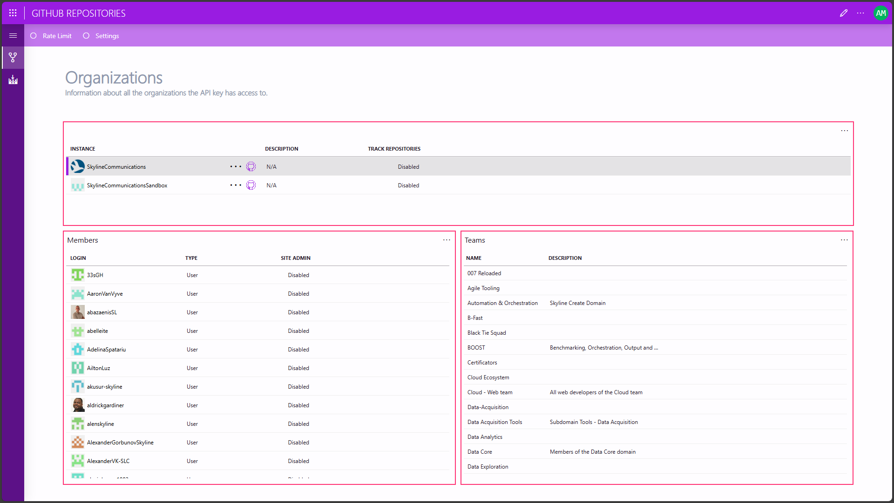

# Gihub Repositories

This Solution is a visual layer on top of the Github Repositories Connector that allows you to monitor and control GitHub repositories. It uses the GitHub API to poll the repos and execute actions on them.

## Getting Started

#### Step 1: Deploy the Low Code App Editor package

1. Click the **Deploy** button to deploy the connector directly to your DataMiner System.
1. Optionally, go to [admin.dataminer.services](https://admin.dataminer.services/) and verify whether the deployment was successfull.

#### Step 2: Configuring the element

1. Go to [Github.com](https://github.com)
1. Sign in and go to *Settings* -> *Developer settings* -> *Personal access tokens* -> *Tokens (classic)*
1. After generating a new token go back to the App and put in the API Key parameter on the *Settings* page.

## Use Cases

### Tracking issues across repositories

A simple use case could be creating an alarm template to notify you when issues or pull requests come in for you repositories. You could create 1 element per group of related repositories. For example you have a Connector repo, Connector Api repo and an automation script repo that all work together.

## Contributing

This solution is spread across 3 different repositories:
- The [Connector repository](https://github.com/SkylineCommunications/SLC-C-Github-Repositories), which handles all the communication to and from Github
- A [Connector API repository](https://github.com/SkylineCommunications/SLC-S-Github-Repositories), which handles communication from anywhere in DataMiner to the element.
- And an [Automation Script repository](https://github.com/SkylineCommunications/SLC-AS-Github-Repositories), that handles some interactivity for the app.

To contribute to this solution, you can make a fork for the repositories where you need changes to happen in and create a pull request. We will do a code review on the changes as soon as possible and merge in the suggestions.

## Support

For additional help, reach out to [arne.maes@skyline.be](mailto:arne.maes@skyline.be)