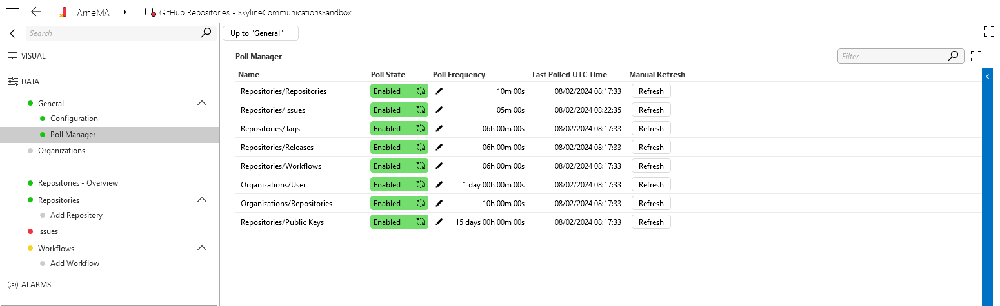
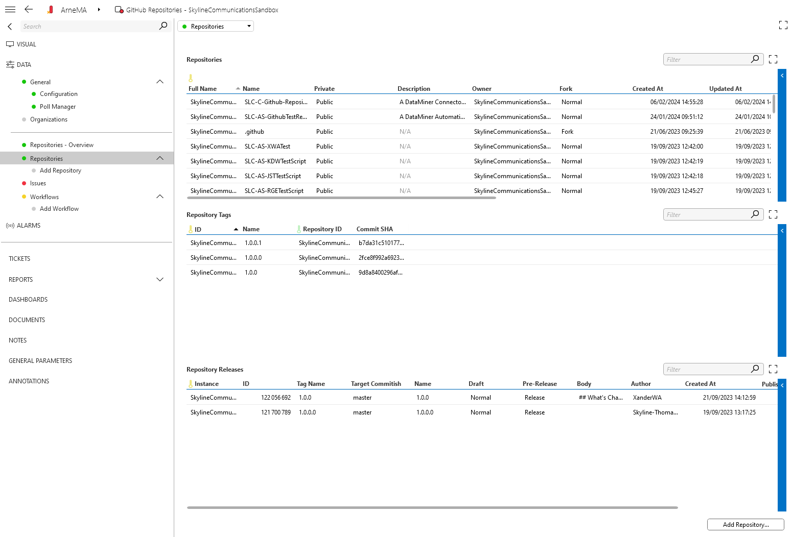

# SLC-Connector-Github-Repositories

A DataMiner connector that retrieves information from github. It's used to monitor repositories.

## Installation

### Manual
You can do a manual install by downloading the .dmprotocol package file from the releases.
1. Go to [releases](https://github.com/SkylineCommunications/SLC-Connector-Github-Repositories/releases)
1. Download the .dmprotocol package from the latest version
1. Install the protocol on your DMA
1. Create an element that uses the connector
1. Fill in **https://api.github.com** as the IP address/host

## Features

- [Configuration](#configuration)
- [Overview](#overview)
- [Organizations](#organizations)
- [Tags](#tags)
- [Releases](#releases)
- [Issues](#issues)

### Configuration
You can configure an API Key under General/Configuration. By default this element runs without an api key. This means that the element can only sent 60 request per hour before being blocked out by Github.
To get more request you can add an api key under General/Configuration page. To generate such a token you can go to Github.com -> Settings -> Developer settings -> Personal access tokens -> tokens (classic), to generate one. After setting a personal api key, you'll get 5000 request per hour.

You can configure the polling timers under General/Poll Manager. Here you can enable or disable certain calls, do a manual refresh and set the poll frequency.

### Overview
On the Repositories - Overview page you get a tree control that shows all the configured repositories. You can view everything thats tracked from here. 
1. Repository information
1. Tags
1. Releases
1. Issues
1. Workflows

### Organizations
On the Organizations page you get an overview of the organizations the configured token is part of. You can enable repository tracking from this page. This will add all the repositories under the repository to the repositories table and start polling them.

### Tags
The tags table contains all the tags from all the tracked repositories. Here you can find the tag name the repository it's linked with and the commit ID it was placed on.

### Releases 
The releases table contains all the releases from all the tracked repositories. Here you can find some general information about the release, for example: 
1. Name
1. Author
1. When it was created
1. ...

### Issues
The issues table contains all the issues from all the tracked repositories. Here you can find some general information about the issues, for example:
1. Title
1. Creator
1. State (open or closed)
1. when it was created
1. ...

### Workflows
The workflows table contains all the workflows from all the tracked repositories. Here you can find some general information about the workflows, for example:
1. Name
1. State
1. Path to the yaml file
1. when it was created
1. ...

## About DataMiner

DataMiner is a transformational platform that provides vendor-independent control and monitoring of devices and services. 
Out of the box and by design, it addresses key challenges such as security, complexity, multi-cloud, and much more. 
It has a pronounced open architecture and powerful capabilities enabling users to evolve easily and continuously.

The foundation of DataMiner is its powerful and versatile data acquisition and control layer. 
With DataMiner, there are no restrictions to what data users can access. 
Data sources may reside on premises, in the cloud, or in a hybrid setup.

A unique catalog of 7000+ connectors already exist. 
In addition, you can leverage DataMiner Development Packages to build you own connectors (also known as "protocols" or "drivers").

> **Note**
> See also: [About DataMiner](https://aka.dataminer.services/about-dataminer).

## About Skyline Communications

At Skyline Communications, we deal in world-class solutions that are deployed by leading companies around the globe. 
Check out [our proven track record](https://aka.dataminer.services/about-skyline) and see how we make our customers' lives easier by empowering them to take their operations to the next level.